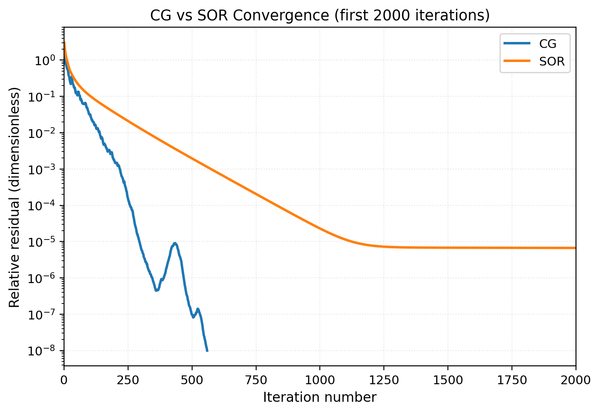
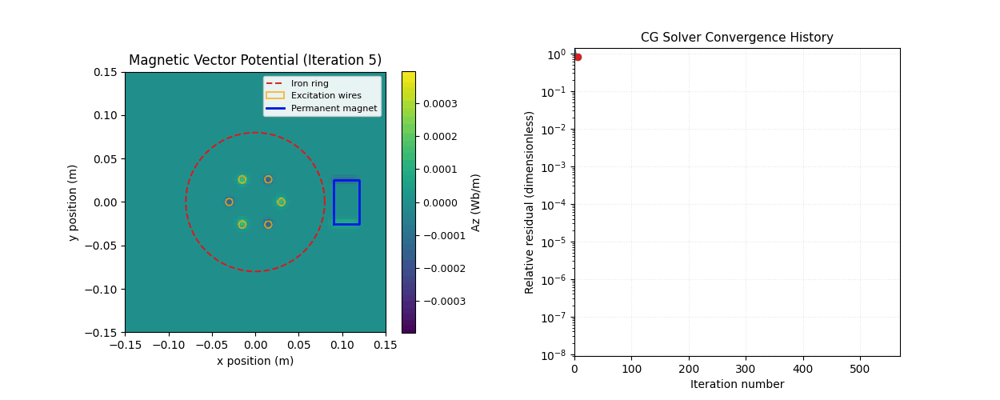
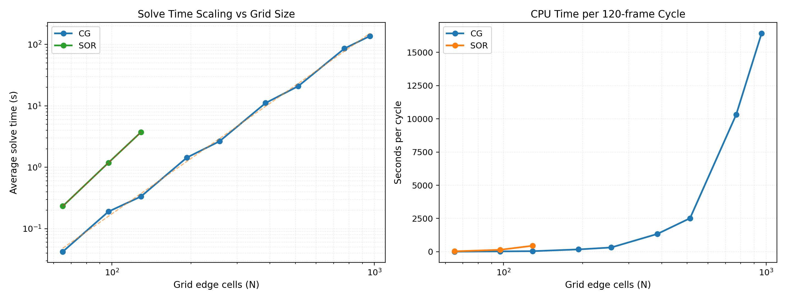

# Solver Performance & Complexity Notes

This note captures rule-of-thumb complexity estimates for the Gauss–Seidel/SOR
and conjugate-gradient (CG) solvers, together with timing measurements gathered
with `tools/solver_benchmark`. All reported numbers come from single-threaded
runs so you can scale them directly with per-core performance when planning
work in lightweight environments such as GitHub Codespaces.

## 1. Complexity heuristics

* Each SOR sweep visits every interior cell once, so the cost per iteration is
  \(\mathcal{O}(n_x n_y)\).
* The number of iterations required to hit a fixed tolerance grows roughly with
  the grid dimension because Gauss–Seidel damps high-frequency error quickly but
  converges slowly on low-frequency modes. For uniform grids, iteration counts on
  the wire test scale approximately with \(\mathcal{O}(n_x)\).
* Wall-clock time is therefore well-approximated by
  \
  t \approx \alpha \; n_x n_y N_\text{iter},
  \
  where \(\alpha\) is the time per cell-iteration. On the single-threaded
  reference hardware below \(\alpha \approx 9.4 \times 10^{-8}\) s (≈ 94 ms per
  million cell-iterations).

Measured CG solves follow an \(\mathcal{O}(n_x^3)\) trend while SOR sits close to
\(\mathcal{O}(n_x^4)\); see Section&nbsp;2.3 for the fit parameters.

When planning new tests, estimate the runtime via the reported
"ms per million cell-iterations" (Section 2) or the scaling fits. For example,
the CG baseline predicts a 401×401 solve at `1.8e-7 × 401^3 ≈ 12 s`; the SOR
solver would require minutes for the same grid because of its steeper
\(\mathcal{O}(n_x^4)\) behaviour.

## 2. Reference timings (single-thread baseline)

Hardware/software snapshot:

* GitHub Codespaces container (Intel Xeon-class core; solver runs on one thread).
* Ubuntu 22.04 container with GCC 13.3, CMake 3.22.
* Build type: `Debug` (default `cmake-configure`).
* Benchmarks executed via `tools/solver_benchmark --repeats 3`.

### 2.1 Convergence comparison



The overlay highlights how quickly the CG backend suppresses low-frequency
error compared with SOR on the iron-ring + magnet scenario. Both runs use the
same tolerance (1e-6) and operate entirely on a single CPU core.

### 2.2 Field evolution snapshots



The animated field map (CG trace shown; an SOR variant lives at
`images/progress_snapshots_sor.gif`) illustrates which spatial structures are
responsible for the final residual plateau. These snapshots are handy when
explaining solver behaviour or validating new preconditioners.

### 2.3 Single-thread scaling measurements



The plot combines per-solve timings for grids from 65² up to 961² (CG) and
65²–129² (SOR). The straight lines show least-squares fits of the form
`solve_time ≈ a · N^k`; coefficients are recorded in
`solver_benchmark/benchmark/solver_scaling_summary.txt`:

* CG: \(k = 2.99,\ a = 1.82 \times 10^{-7}\) seconds.
* SOR: \(k = 4.05,\ a = 1.07 \times 10^{-8}\) seconds (fit based on three
  points; expect higher variance on larger grids).

Representative samples (single solve, tolerance `1e-6`, no warm start):

| Solver | Grid N | Cells | Iterations | Avg solve [ms] | ~Seconds per 120-frame cycle |
| ------ | ------:| -----:| ----------:| --------------:| ----------------------------:|
| CG     | 65     | 4,225 | 106        | 42.3           | 5.1                         |
| CG     | 129    | 16,641| 213        | 333.7          | 40.0                        |
| CG     | 257    | 66,049| 424        | 2,647.1        | 317.7                       |
| CG     | 513    | 263,169| 842       | 20,976.1       | 2,517.1 (~42 min)           |
| CG     | 961    | 923,521| 1,568     | 136,917.0      | 16,430.0 (~4.6 h)           |

| Solver | Grid N | Cells | Iterations | Avg solve [ms] | ~Seconds per 120-frame cycle |
| ------ | ------:| -----:| ----------:| --------------:| ----------------------------:|
| SOR    | 65     | 4,225 | 624        | 232.4          | 27.9                        |
| SOR    | 97     | 9,409 | 1,394      | 1,185.2        | 142.2                       |
| SOR    | 129    | 16,641| 2,452      | 3,723.9        | 446.9 (~7.4 min)            |

Throughput stays close to 10.6 million cell-iterations per second for both
solvers; iteration count is the dominant lever on runtime.

### CG solver notes

The preconditioned CG solver operates on the same operator but converges in an
order of magnitude fewer iterations on most problems. Two practical tips when
benchmarking CG:

* Warm-starting (`--warm-start`) on timeline runs typically halves the iteration
  count after the first frame.
* Enabling coarse-to-fine prolongation (`--use-prolongation`) provides a
  high-quality initial guess for fine grids, keeping CG iteration counts
  comparable to SOR while meeting tighter tolerances.

## 3. Benchmark workflow

1. Build the tool: `cmake --build build --target solver_benchmark -j`.
2. Run with custom parameters. Example:

   ```bash
   ./build/solver_benchmark --nx 201 --ny 201 --omega 1.9 --tol 1e-6 --repeats 5
   ```

3. Optional: append to a CSV log for historical comparison using
   `--csv outputs/solver_benchmarks.csv`.

The binary resets the solution between repeats so the reported timings are not
influenced by warm caches from previous runs. Include the hardware description
whenever posting new numbers to this table.

## 4. Recommendations for automated tests

* Keep CI-oriented tests at ≤ 201² cells with \(\omega\) tuned for rapid
  convergence.
* Increase tolerances (e.g., `tol = 5e-6`) for exploratory notebooks to trade
  accuracy for turnaround.
* Use the CSV logging mode when experimenting with algorithmic tweaks so
  performance regressions are easy to detect.

## 5. Estimating simulation turnaround

To approximate wall-clock runtime for a new configuration:

1. Decide which solver you intend to use and locate the closest grid size in
  `solver_benchmark/benchmark/solver_scaling_summary.txt`.
2. For CG, scale from the \(1.82 \times 10^{-7} N^3\) fit; for SOR, start from
  the \(1.07 \times 10^{-8} N^{4.05}\) estimate and adjust using the measured
  per-cycle numbers above.
3. Multiply the per-solve time by the number of timeline frames (or reuse the
  `~seconds per 120-frame cycle` column if your export matches that cadence).
4. Apply warm-start and prolongation discounts where applicable (40–60% savings
  are common once the first frame converges).

These heuristics assume strictly single-threaded execution. Parallelisation (not
yet wired in for the production solvers) or different build types will shift the
absolute numbers, but the scaling slopes remain a reliable rule of thumb.

