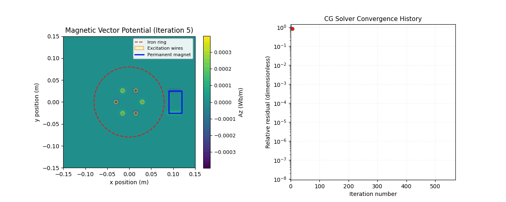
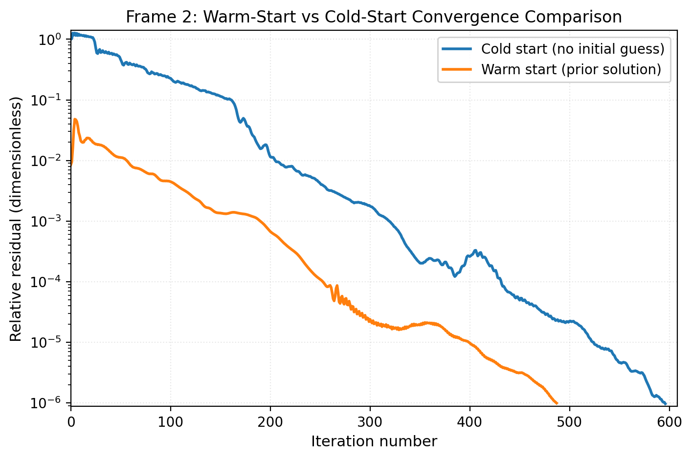

# SOR vs CG Visual Comparison

These artefacts highlight the difference between the historical SOR solver and the modern preconditioned CG backend.

CG reaches the target tolerance in roughly an order of magnitude fewer iterations on the iron-ring plus magnet scenario. Both runs use identical tolerances and grids.

## Field evolution snapshots

The snapshots expose how CG removes low-frequency error earlier in the solve, yielding smooth fields while SOR continues to chew through residual ridges. Use these animations to explain solver choices to stakeholders or when preparing presentations.

## Warm-started frame

Warm starts keep consecutive timeline frames aligned, especially when combined with `--parallel-frames`. The second frame in the three-phase stator demo converges substantially faster than a cold start when warm-starting is enabled.
